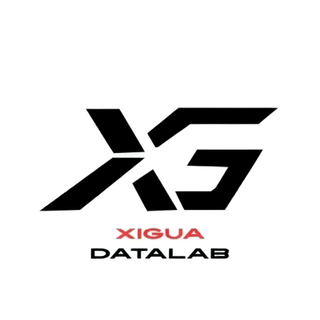

# 👋 Welcome to XiGuaDataLab

---

## 🚀 About Us

We are **XiGuaDataLab** — a data-driven lab focused on exploring, analyzing, and visualizing data to uncover insights and drive innovation.

## 🛠️ Tech Stack

| Category | Technologies |
|----------|-------------|
| **Languages** | Python, SQL, R |
| **Data Analysis** | Pandas, NumPy, SciPy |
| **Visualization** | Matplotlib, Seaborn, Plotly |
| **Machine Learning** | Scikit-learn, TensorFlow, PyTorch |
| **Big Data** | Spark, Hadoop, Hive |
| **Databases** | MySQL, PostgreSQL, MongoDB |

## 📊 GitHub Stats

  
  

## 📫 Connect With Us

  

---

  <i>💡 Data is the new oil. Let's refine it together.</i>

